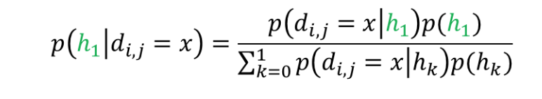
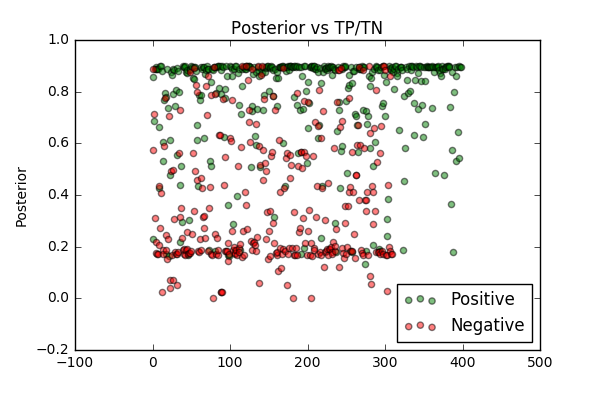
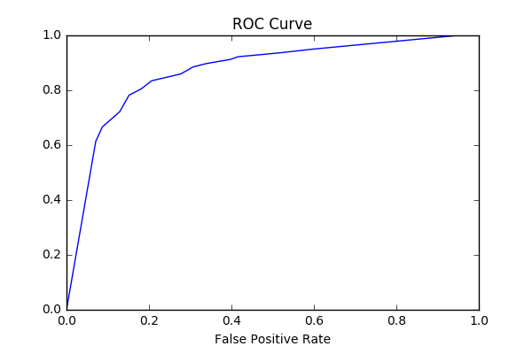
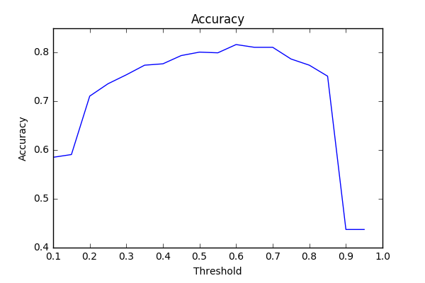
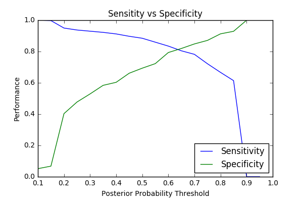

# Operon membership prediction from intergenic distance of two genes

We are using an operon model on the Agro Bacterium genome. We use the operon model to predict whether two genes are likely within the same operon based of the distance between the two genes and use that prediction to infer functional relationship between two genes if they're are predicted within the same operon.

We used a naive bayesian model built off of positive control and negative control.

We used a naive bayesian algorithm to build our operon model.

Our posterior probability is p(h1) is 0.60 which is referenced from a paper linked below discussing operons across prokaryotes in which the average prior probability of an operon pair is 0.60.

[Operons Across Prokaryotes link](https://www.researchgate.net/profile/Gabriel_Moreno-Hagelsieb/publication/233622724_Operons_Across_Prokaryotes_Genomic_Analyses_and_Predictions_300_Genomes_Later/links/0912f5100c29696366000000.pdf)

### Positive Control
It's a set of distances between genes within the same operon from the E.coli genome.

### Negative control
It's a set of distances between genes at the border of neighboring operons from the E.coli genome.

### Threshold

I picked a threshold of 0.60 for predicting operon membership in order to assume very little false positives as possible. I also wanted a threshold that has high sensitivity while having good accuracy based off the curves generated below.

